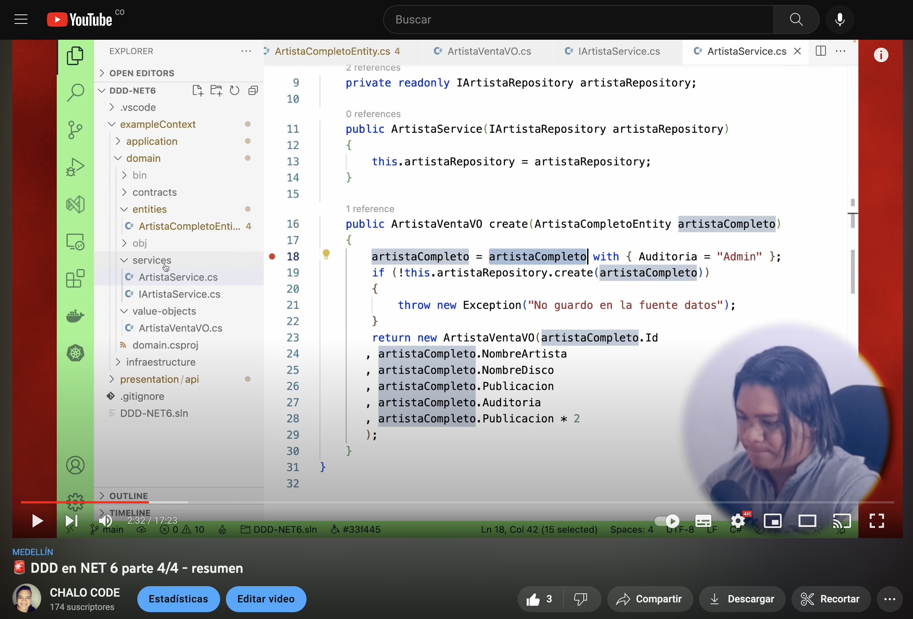

## Explicación del codigo

> Domain Driven Design Technical (DDD) en .NET 6 

🚨 Mini curso DDD en .NET 6 🚨

👉 Domain Driven Design (DDD) - teoría
https://youtu.be/Cm0OaI4tw4E

👉 DDD en NET 6 parte 1/4 - encarpetado
https://youtu.be/QZ8I1lojYYs 

👉 DDD en NET 6 parte 2/4 - proyectos 
https://youtu.be/Gpyi4H3Mo_w

👉 DDD en NET 6 parte 3/4 - mappers
https://youtu.be/MRWRau27ThI

👉 DDD en NET 6 parte 4/4 - resumen
https://youtu.be/OAhlVeLtUbI

📦 Repositorio GitHub
https://github.com/gonzaloperezbarrios/DDD-NET6